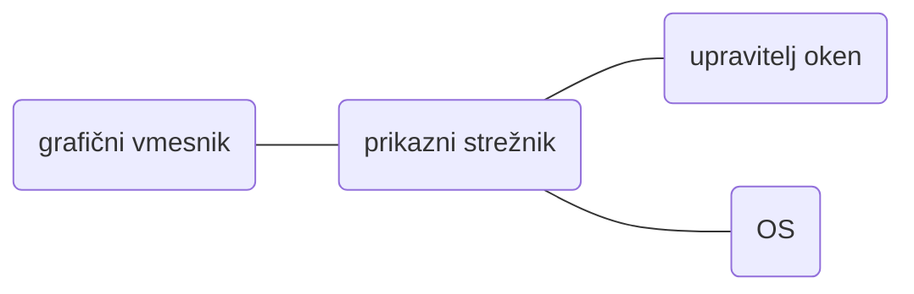

Topics: #TODO-LINKS 
- - -
==Lupina==: program, ki uporabniku nudi osnovni uporabniški vmesnik za uporabo, upravljanje in delo z OS:
- upravljanje z datotekami, procesi, napravami in programi
- nadzor in konfiguracija OS

Uporabniški vmesniki:
- ==grafični==: grafični vmesnik v namiznem okolju
- ==tekstovni==: tekstovni vmesnik v ukazni vrstici
- zvočni (npr. Alexa, Siri, ...)

Uporaba lupine:
- ==interaktivna==: uporabnik vnese ukaz -> lupina ga izvede in sporoči status izvedbe
- ==neinteraktivna==: uporabnik zahteva izvedbo skripte -> lupina jo izvede
### Grafična lupina
Grafični vmesnik (GUI) in napredne vnosne naprave (tipkovnica, miška, zaslon na dotik, ...)
Arhitektura:

==Grafični vmesnik==: grafični elementi za prikaz informacij in interaktivni elementi za vnos ukazov
==Prikazni strežnik==: **medaplikacijska komunikacija v danem protokolu**, posredovanje dogodkov na vhodnih napravah in izris grafičnih elementov
==Upravitelj oken==: nadzor postavitve in prikaza oken (odpiranje, minimizacioja, spremembe velikosti in premiki)
==OS==: video podsistem za upravljanje z GPU napravami

Upravljanje oken:
- ==Skladovni (stacking) / lebdeči (floating)==: izris oken glede na oddaljenost
   ==slikarski algoritem== - od najbolj oddaljenega do najbližjega
   ==obratno slikarski algoritem== - od najbižjega do najbolj oddaljenega
- ==Ploščični (tiling)==: zaslon razdeljen na več neprekrivajočih se področij
- ==Dinamični (dynamic)==: hibrid med skladovnim in ploščičnim
- ==Kompozitni (compositing)==: vsako okno izriše samo zase, menjavaš med njimi
### Ukazna lupina
Tekstovni vmesnik omogoča naprednejšo uporabo
Arhitektura ==REPL==: Read - branje ukaza iz ukazne vrstice, Evaluate - izvedba ukaza, Print - izpis rezultata, Loop - ponovitev prejšnjih 3 faz

Ukazi:
- ==vgrajeni (shell builtin)==: neposredna podpora od same lupine
- ==zunanji (external)==: samostojni programi, shranjeni v izvršljivih datotekah

[[(V) Lupina in bash]]
### Terminal
==Terminal==: konzola, v katerem se izvaja ukazna lupina
Standardni vhod (stdin), izhod (stdout), izhod za napake (stderr)
==Emulator terminala==: program, ki oponaša tekstovni terminal (izvajanje v grafičnem okolju)